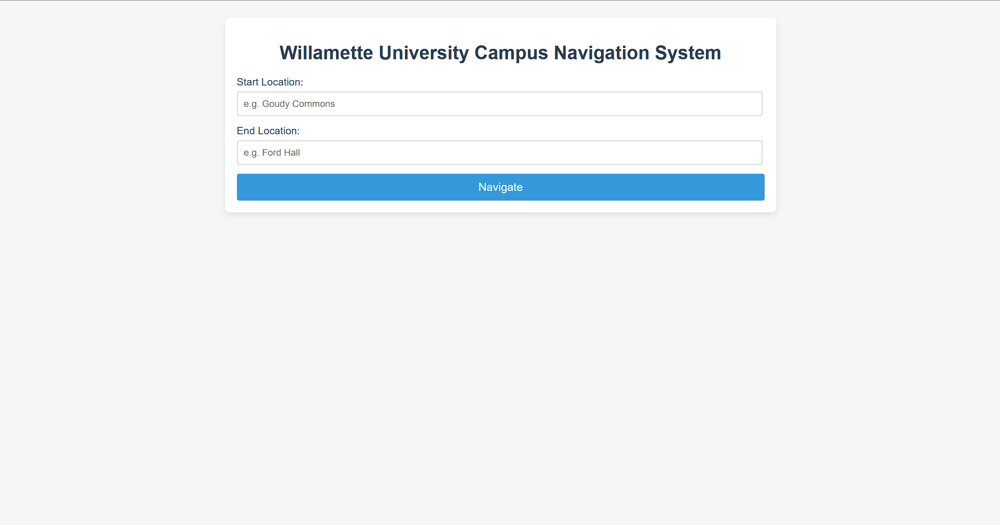
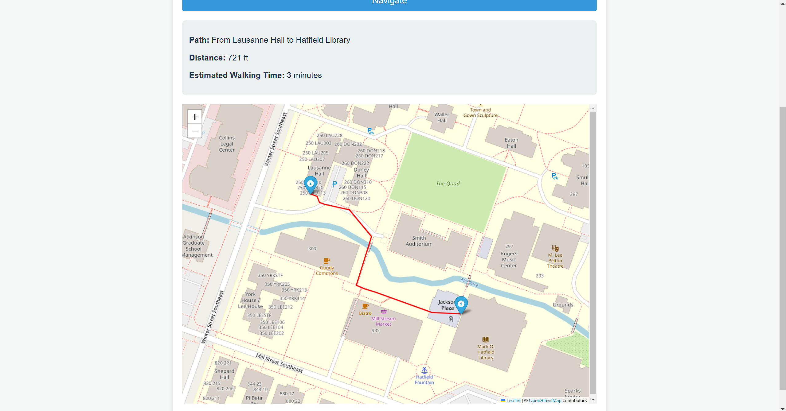

<!-- README.md -->

<div align="center">

  <!--  -->
  <h1>Willamette University Campus Navigation System</h1>
  
  <p>
    A navigation application for Willamette University's main campus in Salem, Oregon. 
  </p
  


<!-- Table of Contents -->
# 📖 Table of Contents

- [About the Project](#🌟-about-the-project)
  * [Screenshots](#📷-screenshots)
  * [Tech Stack](#🤖-tech-stack)
  * [Features](#🎯-features)
- [Getting Started](#🧰-getting-started)
  * [Installation](#⚙️-installation)
  * [Run Locally](#🏃‍➡️-run-locally)
  * [Deployment](#🚩-deployment)
- [Limitations](#🧩-limitations)
- [Roadmap](#🧭-roadmap)
- [Acknowledgements](#💎-acknowledgements)
- [Contact](#🤝-contact)

  

<!-- About the Project -->
## 🌟 About the Project


<!-- Screenshots -->
### 📷 Screenshots
<br>
Home Page:
<div align="center"> 
  
</div>
<br/>
Example Path:
<div align="center"> 
  
</div>

<!-- TechStack -->
### 🤖 Tech Stack

<li>App Framework: <a href="https://flask.palletsprojects.com/en/stable/">Flask</a></li>
<li>WSGI Server: <a href="https://docs.pylonsproject.org/projects/waitress/en/latest/">Waitress</a></li>

<li>Hosting: <a href="https://render.com/">Render</a></li>

<!-- Features -->
### 🎯 Features

This website was created to calculate and visualize the shortest walkable path between any two buildings on Willamette University's main campus in Salem, Oregon. The user inputs the names of two locations. Once the user hits the Navigate button, the shortest walkable path between those two buildings is calculated. The user is shown the distance of the path in feet and the estimated walking time. An embedded map is generated that shows the path.

<!-- Getting Started -->
## 	🧰 Getting Started


<!-- Installation -->
### ⚙️ Installation

All dependencies are contained in [requirements.txt](requirements.txt).

**Clone the project. Then execute the following in the project directory:**
```shell
python -m venv venv 
```
Hit `ctrl + shift + p` $\rarr$ choose `select interpretor` $\rarr$ select `venv`
```shell
./venv/Scripts/activate
```
```shell
pip install -r requirements.txt
```
<!-- Run Locally -->
### 🏃‍➡️ Running Locally

```shell
flask --app app run
```
Open [`http://127.0.0.1:5000`](http://127.0.0.1:5000).

In the terminal, hit `ctrl + c` to quit.


<!-- Deployment -->
### 🚩 Deployment

This projected is hosted using [Render]("https://render.com/"). The live deployed version can be found [here](https://campus-navigation-p46o.onrender.com/). 

Due to being hosted on a free server, the live site may take about one minute to load up.


<!-- Limitations -->
## 🧩 Limitations

This project is still in development, and  thus has the following limitations:

- Missing support for some locations on campus
- Missing some possible shortcuts between locations
- Multiple entrances only currently supported for some locations 

<!-- Roadmap -->
## 🧭 Roadmap

* $\square$ Add support for all locations on campus
* $\square$ Add support for multiple entrances to all locations
* $\square$ Add optional ability to walk through grass for shorter paths

<!-- Acknowledgments -->
## 💎 Acknowledgements

 - Paths and locations manually created using [Google MyMaps](https://www.google.com/mymaps).
 - Map generated using tools from [Folium](https://pypi.org/project/folium/) library.
 - Distance calculations and coordinate management using tools from [GeoPy](https://geopy.readthedocs.io/en/stable/) library.

<!-- Contact -->
## 🤝 Contact

Ben Webster - bkwebster@willamette.edu

Project Link: [https://github.com/bwebster67/campus-navigation](https://github.com/bwebster67/campus-navigation)